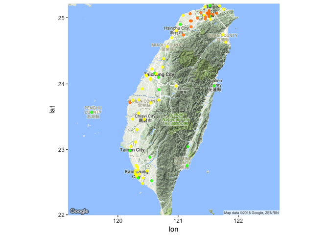

# Loading libraries


```r
library(httr)
library(ggplot2)
library(ggmap)
library(dplyr)
```

```
## Warning: package 'dplyr' was built under R version 3.4.2
```

```
## 
## Attaching package: 'dplyr'
```

```
## The following objects are masked from 'package:stats':
## 
##     filter, lag
```

```
## The following objects are masked from 'package:base':
## 
##     intersect, setdiff, setequal, union
```

```r
library(jsonlite)
options(stringsAsFactors = F)
```


# Reading geolocation data

```r
siteurl <- "https://taqm.epa.gov.tw/taqm/aqs.ashx?lang=tw&act=aqi"
res <- fromJSON(content(GET(siteurl),"text"))
```

```
## Warning in strptime(x, fmt, tz = "GMT"): unknown timezone 'zone/tz/2018c.
## 1.0/zoneinfo/Asia/Taipei'
```

```r
loc.df <- res$Data
loc.df %>% head()
```

```
##   SiteID SiteName AreaID                          addr        Lon
## 1   3102  中油A01      5      高雄市小港區沿海四路50號 120.336613
## 2   3093   中油Q3      5 高雄市林園區五福里石化二路3號  120.40097
## 3   3036     大肚      3       台中市大肚區文昌路133號 120.536801
## 4   3087      C站      5         高雄市小港區中鋼路3號 120.353663
## 5   3026     彰化      3             彰化市民生路338號 120.543075
## 6     71     橋頭      5       高雄市橋頭區隆豐北路1號 120.305689
##         Lat SiteType            siteowner        DataCreationDate    AQI
## 1 22.532316          台灣中油股份有限公司 2017/7/28 上午 08:00:00 154.00
## 2 22.494869          台灣中油股份有限公司 2017/7/28 上午 08:00:00 137.00
## 3 24.151575                  台灣電力公司 2017/7/28 上午 08:00:00 135.00
## 4 22.528177          中國鋼鐵股份有限公司 2017/7/28 上午 07:00:00 123.00
## 5  24.08382                  台灣電力公司 2017/7/28 上午 08:00:00 115.00
## 6 22.757506   背景站     行政院環境保護署 2017/7/28 上午 08:00:00  96.00
##   visble SiteType2
## 1         大型事業
## 2         大型事業
## 3         大型事業
## 4         大型事業
## 5         大型事業
## 6         中央政府
```


```r
# Read Air Quality data ---------------------------------------------------

dataurl <- "https://taqm.epa.gov.tw/taqm/aqs.ashx?lang=tw&act=aqi-epa"
res <- fromJSON(content(GET(dataurl),"text"))
data.df <- res$Data
data.df %>% head()
```

```
##   SiteId SiteName    SiteKey AreaKey MonobjName
## 1     84   富貴角 FugueiCape   North       背景
## 2     64     陽明   Yangming   North       公園
## 3      3     萬里      Wanli   North  背景,一般
## 4     10     淡水     Tamsui   North       一般
## 5      1     基隆    Keelung   North       一般
## 6     11     士林     Shilin   North       一般
##                       Address       lat        lng AQI MainPollutant
## 1      新北市石門區富貴角海邊 25.294147 121.539141  78    細懸浮微粒
## 2   臺北市北投區竹子湖路111號 25.182722 121.529583  53    細懸浮微粒
## 3     新北市萬里區瑪鋉路221號 25.179667 121.689881  71    細懸浮微粒
## 4 新北市淡水區中正東路42巷6號 25.164500 121.449239  70    細懸浮微粒
## 5     基隆市信義區東信路324號 25.129167 121.760056  71    細懸浮微粒
## 6   臺北市北投區文林北路155號 25.105917 121.514500  80    細懸浮微粒
##   MainPollutantKey CityCode PM10 PM10_AVG PM25 PM25_AVG O3 O3_8 SO2   CO
## 1             PM25       31   50       47   26       27 47   41 3.6 0.26
## 2             PM25        1            21            16 31   36 2.1  0.2
## 3             PM25       31   52       40   28       24 50   34  11 0.34
## 4             PM25       31   85       61   29       23 25   15 9.8 0.35
## 5             PM25       11   63       45   32       24 44   22  11 0.45
## 6             PM25        1   62       39   48       27 28   19   5  0.5
##   CO_8 NO2 SO2_VFLAG CO_VFLAG O3_VFLAG PM10_VFLAG NO2_VFLAG THC_VFLAG
## 1 0.30 9.1         1        1        1          1         1         1
## 2 0.20 4.5         1        1        1          3         1          
## 3 0.40  17         1        1        1          1         1          
## 4 0.50  23         1        1        1          1         1          
## 5 0.50  25         1        1        1          1         1         1
## 6 0.50  25         1        1        1          1         1          
##   PM25_VFLAG HO_AQI_VAL THC   x   y DataSrc                Time AQIStyle
## 1          1         78   2 121  86     epa 2018-04-11 11:00:00     AQI2
## 2          3         53     120 120     epa 2018-04-11 11:00:00     AQI2
## 3          1         71     170 119     epa 2018-04-11 11:00:00     AQI2
## 4          1         70      93 119     epa 2018-04-11 11:00:00     AQI2
## 5          1         71   2 189 139     epa 2018-04-11 11:00:00     AQI2
## 6          1         80     125 150     epa 2018-04-11 11:00:00     AQI2
```


# Join data and location data


```r
names(data.df)
```

```
##  [1] "SiteId"           "SiteName"         "SiteKey"         
##  [4] "AreaKey"          "MonobjName"       "Address"         
##  [7] "lat"              "lng"              "AQI"             
## [10] "MainPollutant"    "MainPollutantKey" "CityCode"        
## [13] "PM10"             "PM10_AVG"         "PM25"            
## [16] "PM25_AVG"         "O3"               "O3_8"            
## [19] "SO2"              "CO"               "CO_8"            
## [22] "NO2"              "SO2_VFLAG"        "CO_VFLAG"        
## [25] "O3_VFLAG"         "PM10_VFLAG"       "NO2_VFLAG"       
## [28] "THC_VFLAG"        "PM25_VFLAG"       "HO_AQI_VAL"      
## [31] "THC"              "x"                "y"               
## [34] "DataSrc"          "Time"             "AQIStyle"
```

```r
names(loc.df)
```

```
##  [1] "SiteID"           "SiteName"         "AreaID"          
##  [4] "addr"             "Lon"              "Lat"             
##  [7] "SiteType"         "siteowner"        "DataCreationDate"
## [10] "AQI"              "visble"           "SiteType2"
```

```r
aqxdata <- inner_join(data.df, loc.df, by=c("SiteName"))
aqxdata %>% names()
```

```
##  [1] "SiteId"           "SiteName"         "SiteKey"         
##  [4] "AreaKey"          "MonobjName"       "Address"         
##  [7] "lat"              "lng"              "AQI.x"           
## [10] "MainPollutant"    "MainPollutantKey" "CityCode"        
## [13] "PM10"             "PM10_AVG"         "PM25"            
## [16] "PM25_AVG"         "O3"               "O3_8"            
## [19] "SO2"              "CO"               "CO_8"            
## [22] "NO2"              "SO2_VFLAG"        "CO_VFLAG"        
## [25] "O3_VFLAG"         "PM10_VFLAG"       "NO2_VFLAG"       
## [28] "THC_VFLAG"        "PM25_VFLAG"       "HO_AQI_VAL"      
## [31] "THC"              "x"                "y"               
## [34] "DataSrc"          "Time"             "AQIStyle"        
## [37] "SiteID"           "AreaID"           "addr"            
## [40] "Lon"              "Lat"              "SiteType"        
## [43] "siteowner"        "DataCreationDate" "AQI.y"           
## [46] "visble"           "SiteType2"
```


# Plot a map according to http://taqm.epa.gov.tw/taqm/tw/b0201.aspx

## Convert character vars to numeric

```r
aqxdata$PM25 <- as.numeric(aqxdata$PM25)
aqxdata$Lon <- as.numeric(aqxdata$Lon)
aqxdata$Lat <- as.numeric(aqxdata$Lat)
```


## Dealing missing values

```r
aqxdata$PM25[is.na(aqxdata$PM25)] <- 0
aqxdata <- aqxdata[!is.na(aqxdata$PM25), ]
```


## Design a function to generate color according to different levels
* Using sapply() to generate a color variable


```r
assignColor <- function(index){
  if(index <= 15.4){return("#00FF00")}
  else if(index >= 15.5 && index <= 35.4){return("#FFFF00")}
  else if(index >= 35.5 && index <= 54.4){return("#FF8000")}
  else if(index >= 54.5 && index <= 150.4){return("#FF0000")}
  else if(index >= 150.5 && index <= 250.4){return("#7401DF")}
  else {return("#8A0808")}
}
aqxdata$color <- sapply(aqxdata$PM25, assignColor)
```


# Plot by ggmap

```r
# Plot data on map with color
ggmap(get_googlemap(center=c(120.9248395,23.6151486),zoom=8,maptype='terrain')) +
  geom_point(data = aqxdata, aes(Lon, Lat), colour = aqxdata$color, alpha=0.8)
```

```
## Map from URL : http://maps.googleapis.com/maps/api/staticmap?center=23.615149,120.92484&zoom=8&size=640x640&scale=2&maptype=terrain&sensor=false
```

```
## Warning: Removed 4 rows containing missing values (geom_point).
```

<!-- -->

